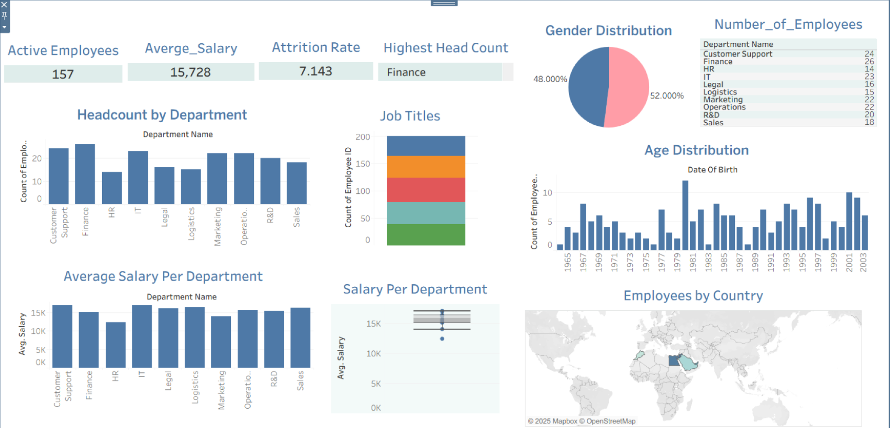

# 📊 HR Analytics Dashboard | Tableau Project

The goal of this Tableau dashboard is to deliver comprehensive insights into the organization's workforce using HR data.  
By analyzing employee demographics, salary distribution, departmental trends, and attrition, the dashboard aims to support data-driven decisions related to talent retention, compensation planning, and department-level management.

---

### 🎯 Project Objectives
- Analyze employee demographics and salary distribution  
- Identify department-level trends  
- Measure attrition and gender diversity  
- Support HR managers in data-driven decision-making  

---

### 🧩 Key Performance Indicators (KPIs)
1. Total Employees  
2. Average Salary  
3. Attrition Rate  
4. Department Headcount  
5. Gender Diversity Ratio  

---

### 📈 Visuals Included
- Headcount by Department  
- Salary Distribution by Department  
- Gender Ratio (Pie Chart)  
- Age Distribution (Histogram)  
- Job Titles by Count (Stacked Bar)  
- Employees by Country (Map)  
- KPI Summary Tiles  
 
---

### 🔍 Key Insights
- The **Sales Department** has the highest average salary, indicating strong performance-based incentives.  
- **Female employees** represent around 40% of the workforce, showing moderate gender diversity.  
- The **attrition rate** is highest among employees with less than 2 years of experience.  
- The **average salary** across departments is around 15K, with minor variation between teams.  

---

### 🛠️ Tools Used
- **Tableau** — for visualization and dashboard creation  
- **Excel** — for data cleaning and preparation  

---
### 🗂️ Project Structure
Data/ → Contains the cleaned Excel datasets used in the dashboard.
Dashboard/ → Contains Tableau dashboard files (.twb and .twbx).

To open the dashboard correctly, please make sure to download the data files as w
---

### 📷 Dashboard Preview

---
